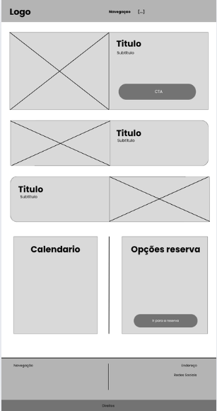

# 🏨 Projeto Costa Serena Resort

Um sistema completo para gestão de resorts, focado na eficiência operacional e na experiência do hóspede. Este projeto foi desenvolvido como parte de uma avaliação semestral.

## 📝 Sobre o Projeto

O sistema de gestão do Costa Serena foi projetado para resolver problemas comuns na administração de resorts, integrando diversas áreas como reservas, hospedagem, serviços de quarto e relatórios financeiros em uma única plataforma. A interface busca ser intuitiva e com um tempo de resposta rápido para garantir a melhor experiência tanto para os funcionários quanto para os clientes.

## 🛠️ Tecnologias Utilizadas

* **Front-End:** HTML, CSS
* **Back-End:** Python
* **Banco de Dados:** MySQL

## ✨ Funcionalidades Principais

-   [x] **Gestão de Reservas:** Sistema completo para agendamento.
-   [x] **Controle de Hospedagem:** Processos de Check-in e Check-out.
-   [x] **Área Administrativa Restrita:** Painel de controle para funcionários.
-   [x] **Integração de Sistemas:** Conexão com estacionamento, serviço de quarto, etc.
-   [x] **Gestão de Funcionários:** Cadastro e controle de permissões.
-   [x] **Relatórios Financeiros:** Geração de relatórios por período (dia, mês, trimestre, etc.).

## 🖼️ Telas do Sistema

Aqui é um wireframe do projeto.

_Tela de login para a área administrativa._

## 🚀 Como Executar o Projeto

*(Esta seção será preenchida com o link do projeto em breve)*

## 👥 Equipe

| Nome do Membro | GitHub |
| :--- | :--- |
| (Vinicius Pini) | (https://github.com/chronos333) |
| (Rian Eduardo) | (link) |
| (Filipe Reis) | (https://github.com/Filipe1473) |
| (Guilherme Biondo) | (link) |
| (Larissa Lima) | (link) |
| (Daniel Cabral) | (link) |
